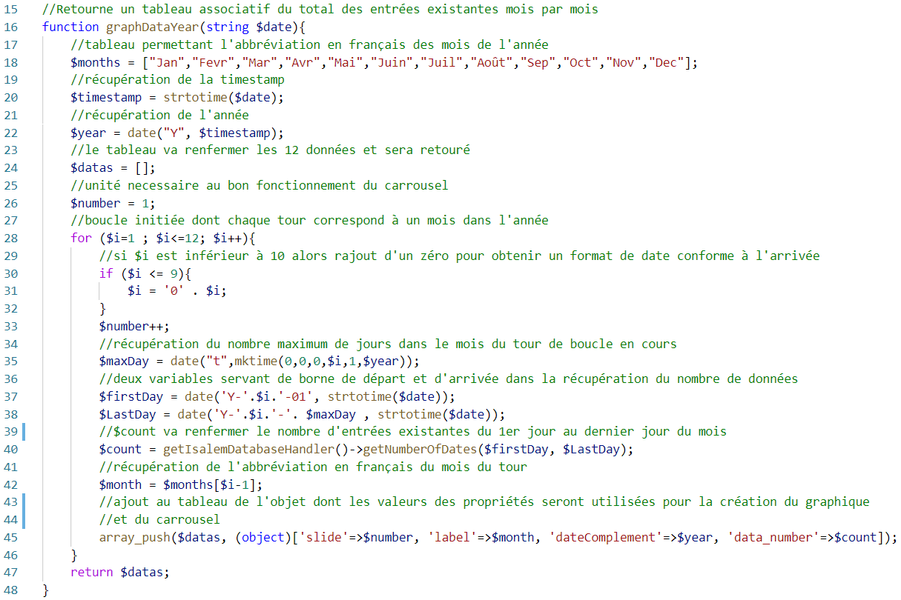
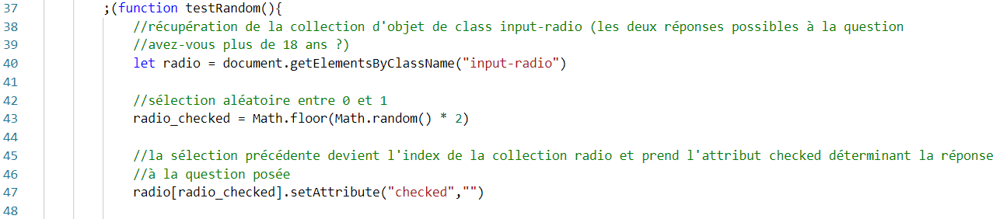

# Projet professionnel réalisé en entreprise (WILLGO) pour l'obtention du titre RNCP de développeur web et web mobile - Alkas-Formation

* ## Introduction
* ## Résumé 
* ## Compétences couvertes par le projet :
    * ### Maquetter une application
    * ### Réaliser une interface utilisateur web statique et adaptable
    * ### Développer une interface utilisateur web dynamique
    * ### Développer les composants d’accès aux données
    * ### Développer la partie back-end d’une application web ou web mobile
* ## Cahier des charges :
* ## Spécifications techniques du projet :
    * ### Maquette du site
    * ### Front-end
    * ### Back-end
* ## Réalisations et extraits de code
    * ### Le questionnaire : 
        * #### Affichage du questionnaire
        * #### Traitement du questionnaire
        * #### Affichage du résultat
    * ### Les statistiques :
        * #### Traitement de la demande : 
        * #### 
    * ### La création d’un admin
* ## Présentation du jeu d’essai
    * ### Côté utilisateur
    * ### Côté administrateur
* ## Veille effectuée sur les vulnérabilités de sécurité
* ## Conclusion :
# 
## Introduction :

### Dans le cadre de mon stage en entreprise en vue de l’obtention du titre de développeur web et web mobile, j’ai intégré la société WILLGO dirigé par Mr William Godiveau.
### WILLGO est une jeune entreprise qui travaille essentiellement sur la création et la maintenance de sites internet à l’aide des CMS WordPress et PrestaShop ainsi que l’accompagnement des clients dans leur stratégie digitale (SEO, gestion des réseaux sociaux, …)
### Mr Godiveau élabore également différents projets personnels directement liés à son activité principale mais également ambitionne la création de son organisme de formation Absys-Formation.
### Mes journées ont donc été découpé en deux parties : La participation à l’activité professionnelle de l’entreprise pendant laquelle j’ai pu travailler sur différents sites aux activités variées : BTP, e-commerce, immobilier, éducatifs... Principalement avec WordPress mais aussi PrestaShop, en utilisant différents constructeurs. L’autre partie de la journée étant dédiée à la réalisation de mon projet.
### J’ai travaillé seul sous la responsabilité de Mr Godiveau, en totale autonomie avec des points réguliers avec ce dernier afin de discuter de la logique de programmation et de ses attentes sur l’évolution du projet.

## Résumé :

### En vue de la création de son organisme de formation, Absys-Formation, et étant déjà actif sur différentes plateformes de formation en ligne, Mr Godiveau m’a demandé de mettre en application le questionnaire ISALEM. Il a pour but à travers une série de 12 questions de renvoyer le profil idéal d’apprentissage de l’élève et ainsi permettre au formateur d’adapter son discours en fonction de l’apprenant.
### Il m’a donc été demandé de programmer un remplissage simple et rapide du questionnaire pour l’utilisateur, ne nécessitant aucune création de compte à ce niveau, et permettant d’en obtenir le résultat. Quatre résultats sont possibles, représentant chacun l’un des styles d’apprentissage. A noter également la possibilité d’envoyer et/ou recevoir le résultat par mail, permettant par exemple d’informer le formateur.
### Du côté administrateur, il est possible d’accéder après connexion à des fonctionnalités de gestion pour la sélection, création, modification ou la suppression de certains éléments (statistiques, administrateurs, mails types, …). Il existe une hiérarchie des rôles, la gestion des administrateurs n’étant possible que par un SUPER_ADMIN.
### Pour la réalisation du projet j’ai donc pu à la fois utiliser PHP pour communiquer avec la base de données, celle-ci composée de 10 tables, et pour sécuriser les différentes parties de l’application et leur accessibilité. Mais également JavaScript pour faciliter le remplissage du questionnaire, sa bibliothèque Chart.js utilisée pour l’élaboration de statistiques et également l’utilisation de Bootstrap pour sa rapidité d’utilisation et la création de carrousels et formulaires.

 ## Compétences couvertes par le projet :
 * ### MAQUETTER UNE APPLICATION :
### Le questionnaire ISALEM étant déjà existant, il me fallait d’un côté en respecter ses principes (les questions et réponses, les résultats donnant le profil de l’apprenant et le graphique indiquant d’un point rouge la position de l’apprenant sur celui-ci suite au traitement des réponses données) mais également veiller à intégrer les demandes de Mr Godiveau, à savoir une interface administrateur permettant la gestion des différents composants de l’application mais aussi la lecture de statistiques.
### J’ai pour ce faire d’abord esquisser les différentes tables afin de poser mes idées avant une mise au propre avec draw.io afin de soumettre la maquette à Mr Godiveau et commencer à travailler avec son approbation.

* ### REALISER UNE INTERFACE UTILISATEUR WEB STATIQUE ET ADAPTABLE :
### La structure des pages est faîte en HTML. Ses balises intègrent le système de classes de Bootstrap permettant un visuel accessible rapidement et adaptable. En utilisant l’attribut data-label dans les balises <td> de mes différents tableaux qui composent les pages de l’interface administrateur, j’ai pu permettre un visuel adaptable aux différentes tailles d’écrans.
* ### DEVELOPPER UNE INTERFACE UTILISATEUR WEB DYNAMIQUE :
### Chaque question propose 4 réponses, il s’agit de leur attribuer un classement de 1 à 4. 
### La programmation que j’ai réalisé du questionnaire permet pour chaque question, d’attribuer les valeurs aux réponses par simple clic dans l’ordre croissant, l’utilisation du clavier numérique n’est donc pas nécessaire. Il est également possible, toujours par simple clic sur un bouton, d’effacer les réponses déjà données par ordre décroissant cette fois. De plus si l’une des réponses présente déjà une valeur et que l’utilisateur tente à l’aide de son clavier numérique de donner la même valeur à une autre réponse de la même question, la première valeur sera alors effacée, garantissant un classement systématique de 1 à 4. 
* ### DEVELOPPER LES COMPOSANTS D’ACCES AUX DONNEES :
### J’ai créé une base de données composées de 10 tables dont certaines relationnelles comme par exemple la table « question » en relation avec la table « answer » ainsi il met possible à l’affichage de récupérer les réponses de chaque question.
### J’ai développé une interface administrateur permettant la sélection, modification, création ou l’effacement, en fonction des besoins, les données de 9 tables.
### Côté logique de programmation, j’ai utilisé le DataBaseHandler pour convertir les données en Objets.
### DEVELOPPER LA PARTIE BACK-END D’UNE APPLICATION WEB OU WEB MOBILE :
### Côté back-end, une page « db.php » où on retrouve le DataBaseHandler et ses différentes méthodes CRUD communique avec une page « display_function.php » gérant l’affichage des objets renvoyés. A noter une fonction « connect() » dans le constructor de la classe DataBaseHandler ayant pour but de permettre une connexion automatique à chaque instanciation de ce dernier. Une fonction « getIsalemDataBaseHandler » permet de rapidement l’instancier dans les différents fichiers.

### Dans la globalité du projet les pages communiquent entre elles pour le traitement des données ou leur affichage. Le traitement des données après validation de certaines conditions peut soit se faire soit entrainer une redirection afin d’informer par un message l’utilisateur d’une erreur de champ (erreur de saisie, champ vide, …).
#
## Cahier des charges :
1.	### Présentation du commanditaire
### Le présent cahier des charges a pour but la création d'un site web permettant la présentation et la réalisation du questionnaire ISALEM, ce dernier créé en 1997 par l’université de Liège n’est à ce jour ni facile ni rapide dans son utilisation. Il convient donc de remédier à cela. 
### Société : Absys-Formation
### Activité : Organisme de formation
### Nombre de personnes : Le propriétaire de l’organisme Mr William Godiveau
### Description des services : A ce jour l’organisme est en cours de création, son gérant attendant l’agrémentation nécessaire, cependant il proposera des formations diverses en rapport avec son autre entreprise WILLGO, telles que WordPress, Prestashop, SEO, réseaux sociaux.
2. ### Nature de la demande
### La demande émane de Mr Godiveau, dirigeant de l’agence web WILLGO. Il est également formateur et intervient pour différents organismes, principalement à distance et projette donc très prochainement de représenter son organisme de formation, Absys-Formation. Le besoin est ainsi né de son expérience. Il est important pour lui de mieux connaître ses apprenants, la réalisation du questionnaire ISALEM lui offre cette possibilité. 
### Le remplissage du questionnaire par l’élève doit être le plus simple possible et ne pas nécessiter la création d’un compte. 
### Il convient de créer un espace administrateur permettant une gestion la plus globale possible des éléments du site par Mr Godiveau.
### Le rendu du projet doit respecter les codes couleurs du site Absys-Formation.
### La demande comprend donc la mise en application de manière dynamique du questionnaire ISALEM, de respecter ses fondamentaux (algorithme de traitement, profils renvoyés). Elle comprend également la mise en place d’outils permettant de consulter les statistiques de réalisation du questionnaire.
3. ### Prestations attendues
### Technique : 
- ### Création d’un site présentant le questionnaire ISALEM, ses questions et réponses et renvoyant l’un des 4 profils d’apprentissage possibles.
- ### Ajout d’un formulaire de contact
- ### Statistiques de réalisation du questionnaire consultable depuis l’interface administrateur
### Graphique :
- ### Respect des codes couleurs du site Absys-Formation (#053f81, #f48120)
- ### Il doit être simple de remplir le questionnaire
- ### Le résultat doit être également accompagné d’un graphique fidèle à celui créé en 1997.
- ### Il doit être responsive et donc adaptable sur pc, tablettes et mobiles.
4. ### Livrables impératifs
### En fin de prestation, Mr Godiveau doit recevoir les éléments suivants :
- ### Un site web permettant de réaliser le questionnaire ISALEM, d’en obtenir le résultat et la possibilité d’envoyer le résultat par email.
- ### Un espace administrateur permettant la gestion des éléments du questionnaire et la consultation de statistiques de réalisation de celui-ci.

5. ### Arborescence du site
 ### L’arborescence du projet correspondra au schéma suivant :

## Spécifications techniques du projet :

### MAQUETTE DU SITE :
### Après discussion avec Mr Godiveau, à partir de ses attentes de gestion des composants du site et après recherches pour comprendre l’architecture et comment fonctionne le questionnaire ISALEM, j’ai, à partir de draw.io, maquetter le projet.

### FRONT-END :
### Pour cette partie j’ai utilisé les langages suivants :
### HTML : 
### Pour structurer et mettre en forme les pages, mais également pour obtenir une première validation de conformité du questionnaire avec les attributs max et min par exemple ou l’attribut pattern pour les formulaires.
### JavaScript (et ses bibliothèques ChartJS et JQuery) :  
### Ce langage m’a permis d’intervenir à plusieurs niveaux sur la programmation du projet :
### La page du questionnaire :
###  - Pour la facilité de remplissage du questionnaire, chaque réponse d’une question devant être notée de 1 à 4, une fonction m’a permis à chaque clic de noter 1, puis 2, puis 3 et 4 les réponses. Evitant ainsi l’utilisation du clavier numérique.
### - Toujours dans un but de faciliter le questionnaire, une autre fonction à partir d’un bouton présent pour chaque question permet d’effacer à chaque clic une réponse dans l’ordre décroissant des valeurs présentes.
### - Pour chaque question les valeurs attribuées doivent être unique. Pour éviter une valeur doublée dans les réponses d’une question (par exemple la présence de deux fois la valeur 3) une fonction, lorsqu’une valeur déjà attribuée est ajoutée de nouveau, efface la première valeur. Ainsi si la réponse « a » à comme valeur 3 et que l’utilisateur décide de mettre à l’aide de son clavier numérique à la réponse « b » une nouvelle fois la valeur 3, la valeur de la réponse « a » sera effacée.
### La page du résultat :
### - Un des impératifs de la prestation était d’obtenir un graphique affichant l’axe des abscisses et des ordonnées, la valeur 0 étant le centre de celui-ci. Il fallait qu’un point s’affiche, correspondant à la jonction des points x et y, ces derniers étant le résultat du traitement du questionnaire précédemment rempli. J’ai donc utilisé la balise canvas en y associant les différentes fonction Javascript pour tracer le graphique, la graduation des axes et l’affichage du point.
### La page d’accueil :
### - La bibliothèque JQuery est brièvement utilisée pour simplement modifier le comportement par défaut du carrousel bootstrap. En effet utilisé dans sa version d’origine, il se met en pause dès que le curseur est dessus.
### - La bibliothèque ChartJS, quant à elle, m’a permis de créer les statistiques du côté administrateur.
### Bootstrap :
### Ce Framework m’a permis de créer rapidement une interface graphique adaptable grâce à son système de classes. Particulièrement utile pour la mise en page des différents formulaires et pour la création de carrousels en page d’accueil et côté interface administrateur pour la page de statistiques.
### BACK-END :
### phpMyAdmin:
### L’interface graphique qui me permet de gérer le gestionnaire de la base de données du projet.
### MariaDB :
### Le gestionnaire de la base de données relationnelles. Cette dernière est composée de 10 tables.

### PHP :
### La logique d’exécution du projet se base sur l’outil DataBaseHandler qui va agir dans la logique d’un ORM, pour Object Relational Mapping, permettant de convertir les données de la base de données en des Objets manipulables dans PHP. Le code se retrouve ainsi plus lisible avec la création de méthodes permettant alors le dialogue avec SQL, et va renvoyer des objets à partir de mes modèles créés, c’est-à-dire des fichiers créés et retournant chacun d’eux une classe représentant une table de la base de données.
### Un autre fichier nommé « display_function.php » me permet d’y programmer toutes les fonctions d’affichage des objets renvoyées par les méthodes du fichier précédent.
### L’utilisation de PHP m’a permis également de sécuriser l’accès à l’interface admin en programmant entre autres la vérification dans $_SESSION, grâce à la fonction isset(), d’un ID admin valide pour chaque fichier. Mais aussi à sécuriser le traitement du questionnaire pour vérifier que toutes les données souhaitées existent (présence de toutes les réponses attendues, données numériques entre 1 et 4, total des variables de $_POST renfermant les réponses devant être égal à 120, …). Ainsi, bien que du côté HTML par ses attributs et du côté Javascript par des fonctions créées, des vérifications de conformité du questionnaire sont déjà existantes, elles ne s’arrêtent pas là puisque facilement contournables pour un utilisateur renseigné.
### Ce langage me permet également, pour la page contact, la mise en place d’un captcha et une vérification de conformité des champs par la fonction preg_match().
### Des vérifications du côté de la gestion des admins (uniquement accessible par un SUPER_ADMIN) sont également faîtes côté PHP comme par exemple : 
- ### 	Hachage du mot de passe dans la base de données avec la fonction password_hash() et sa vérification à la connexion avec cette fois password_verify(). 
- ### 	Ne pas pouvoir effacer un admin dont l’adresse email est enregistrée comme email de contact, un message d’information est alors renvoyé.
- ### 	La création ou la modification d’un admin ne peut pas se faire si l’adresse email renseignée est déjà utilisée.
#
## Réalisations et extraits de code
### LE QUESTIONNAIRE :
### La première véritable tâche qui a demandé une réflexion, une succession d’essais de différentes logiques fut le questionnaire ISALEM, à savoir son affichage, son traitement, et son résultat.
### Affichage du questionnaire :
### Sur ce premier niveau il s’agissait d’afficher un formulaire ayant une première question demandant si l’apprenant à plus ou moins de 18 ans, et l’affichage du questionnaire et donc de chaque question et de ses 4 réponses associées.
### Cela a nécessité 2 tables « question » et « answer » en relation « n1 » puisqu’une question peut avoir plusieurs réponses et une réponse une seule question.
### A partir de cela, il me fallait créer, dans le fichier « db.php », des méthodes CRUD, plus précisément des READ ou SELECT, appartenant à ma classe « DataBaseHandler ». Ainsi que des fonctions d’affichage, dans un fichier spécifique à ces fonctions (« display_function.php »), pour les méthodes renvoyant des objets.
### Pour cela j’ai créé 2 méthodes, l’une permet la récupération d’un objet « question » par son ID et l’autre la récupération d’un tableau d’objets de réponses par l’ID d’une question.

### Ainsi l’affichage peut se faire dans la logique suivante :
- ### 	Une boucle « for » qui pour chaque tour va utiliser l’index comme paramètre de la méthode getQuestion(int $id) , l’objet récupéré sera donné comme paramètre à sa fonction d’affichage.
- ### 	Et dans ce même tour, récupération du tableau d’objets de réponses avec le même index comme paramètre. Ainsi sont obtenues les bonnes réponses à la question récupérée précédemment. Un dernier « foreach » sur ce tableau me permet d’appeler la fonction d’affichage de la réponse avec comme paramètre l’objet.

## Traitement du questionnaire :
- ### Problématique rencontrée :
### Le questionnaire maintenant rempli et l’apprenant ayant confirmé l’envoi, il fallait d’abord récupérer les réponses et en retirer un résultat, mais également faciliter l’interprétation de ce résultat. Le traitement prévoyait une difficulté supplémentaire, mais l’algorithme offrait l’avantage d’être déjà connu :
- ### Plus de 18 ans :  $x = $I - $Ab – 8 et $y = $Ac - $R – 5
- ### Moins de 18 ans : $x = $I - $Ab – 2 et $y = $Ac - $R – 2
### Il y a donc 48 réponses nécessitant une valeur numérique de 1 à 4 et lors du traitement 4 variables dont la somme chacune de 12 réponses permettent le calcul ci-dessus. Cependant, afin d’éviter de deviner par avance un possible profil de résultat, toutes les réponses a, b c ou d ne remplissent pas la même variable mais suivent un schéma précis. Par exemple la valeur de la réponse « a » de la question « 1 » s’ajoute à la variable « $Ab » tandis que celle de la question « 2 » à la variable « $R ». Il fallait donc pouvoir cibler les réponses et les rediriger dans la bonne variable. Ceci ayant pour but d’obtenir une valeur « x » et « y » déterminant la position de l’apprenant sur un graphique et donc son profil.
- ### Solution apportée :
### Afin de récupérer les valeurs des 48 réponses et pouvoir rediriger chacune d’elle dans la bonne variable, il me fallait à la fois une identité propre à chaque réponse mais aussi un repère permettant de les diriger vers les bonnes variables nécessaires à l’algorithme. J’ai donc ajouté une colonne « category » à la table « answer », celles-ci au nombre de 4 (Ab, Ac, Ai, Ar). J’ai ainsi prédéfini dans quelle variable traiter la valeur de chaque réponse. Pour l’identité propre, j’ai ajouté une colonne « numberInList » à ma table, attribuant ainsi un nombre de 1 à 48. 

### Chaque réponse étant identifiable l’une de l’autre, j’ai donc pu diriger avec exactitude leur valeur dans l’une des 4 variables avant de procéder au calcul de x et y.

### Le fait de les inclure d’abord dans un tableau me permet une vérification supplémentaire, à savoir que chaque tableau à la fin du foreach() possède bien 12 valeurs et je vérifies également que la somme de tous les tableaux soit bien égale à 120 car il ne peut en être autrement.

### Après vérification à la question « plus ou moins de 18 ans » il est possible de procéder au calcul de x et y.

## Affichage du résultat :
- ### Problématique rencontrée :
### Maintenant que les valeurs de x et y sont connues, il me fallait les interpréter pour afficher le résultat approprié ; c’est à dire le bon profil de l’apprenant ainsi que la représentation visuelle d’un point sur le graphique correspondant à la rencontre de x et y.
- ### Solution apportée :
### (La méthode d’affichage se découpe en 2 parties, la première en PHP et la seconde en Javascript.)
### PHP
### En définitive le bon profil ne se résumant pas à une valeur précise de x et y mais au fait que celles-ci soient positive ou négative, j’ai ajouté une colonne « category » à la table « result » ; 4 résultats étant possibles, chacun possède une catégorie en fonction de sa position sur le graphique à savoir « -xy », « xy », « x-y » et « -x-y ».
### Ainsi j’ai pu, en déterminant la nature positive ou négative de x et y, créer une chaine de caractères correspondant à l’une de ces catégories et la renvoyer dans $_SESSION afin de l’interpréter dans la page de résultat par une méthode getResultofTest($category) et de l’afficher à partir d’une fonction displayResult($result).

### Le traitement du questionnaire côté PHP étant au point, le travail n’était pas pour autant terminé car il fallait maintenant faire apparaitre le graphique avec le point placé en fonction de x et y. 
### Comme visible sur la fin de l’extrait de code du fichier « tr_questionnaire.php », les valeurs de « $x » et $y » sont également renvoyées par l’intermédiaire de « $_SESSION ».
### Javascript
### J’ai opté pour l’utilisation de la balise canvas pour faire apparaître le graphique voulu et créé plusieurs fonctions dans son élaboration.
### Sachant que le graphique comporte de nombreuses lignes puisqu’incluant les axes des abscisses et des ordonnées mais aussi une graduation, une première fonction permet cela.

### J’ai donc pu tracer les 2 axes.

### Puis effectuer la graduation des axes à l’échelle de 5px pour 1mm.

### La graduation nécessitait un repère plus grand tous les 25px (ou à taille réelle 5mm), j’ai mis en place pour cela 2 fonctions qui les tracent en partant du point central du canvas, visuellement 0 et dans sa programmation du canvas (190,190).

### J’ai ensuite récupéré les valeurs de x et y dont l’information est située sous le graphique afin de les utiliser dans la création du repère visuel. Pour cela j’ai également dû convertir leur valeur afin d’être à l’échelle du graphique.

### La dernière étape consistait à faire apparaître les noms des 4 grands profils sur le graphique. Là également, j’ai créé une fonction me permettant de rapidement le faire.

### LES STATISTIQUES :
### Du côté administrateur, l’affichage de statistiques était une demande spécifique du commanditaire du projet et comme pour l’affichage du résultat précédemment expliqué cela a nécessité l’utilisation de PHP et de Javascript.
### Traitement de la demande :
### J’ai mis en place tout d’abord un formulaire simple à deux champs, l’un pour renseigner le mois, il s’agit d’un bouton select dont les options correspondent chacune à un mois de l’année écrit en toutes lettres et l’autre l’année dont la valeur par défaut est l’année en cours par l’utilisation de : 
### <?php echo date("Y");?>

### L’administrateur peut donc s’il remplit les 2 champs obtenir les statistiques jour par jour du mois de l’année demandé ou s’il ne remplit pas le mois, ceux mois par mois de l’année souhaitée. 
### Je récupère ensuite par l’intermédiaire de $_POST les données afin de les interpréter et déterminer la demande de l’administrateur ; souhaite t’il les statistiques sur un mois ou de toute une année ?

 

### Après cette condition vérifiée, le traitement de la demande, maintenant comprise, peut avoir lieu. Pour cela, comme visible aux lignes 97 et 103 de l’extrait de code de l’Annexe 4 j’ai mis en place 2 fonctions.
### L’une pour renvoyer toutes les données mois par mois d’une année (voir Annexe 5) et la seconde pour renvoyer celles jour par jour dans un mois (voir Annexe 6).

### Ces deux fonctions me permettent de récupérer un tableau d’objets dont les propriétés permettent plusieurs choses :
### D’abord la création du carrousel Bootstrap, qui va nécessiter une 
 dont l’ID prend la valeur « slide-$number », et également le remplissage du « slide » avec les bonnes données. Une fonction d’affichage, unique aux deux possibilités, inclus dans un « foreach() » permet cela :

### Affichage du graphique :
### Le carrousel maintenant créé, restait la création du graphique. Pour cela j’ai utilisé la bibliothèque Chart.js et sa documentation.
### Pour qu’un graphique puisse s’afficher, certaines données sont évidemment primordiales et potentiellement différentes à chaque demande. Il me fallait donc principalement récupérer : les « labels » ou clés permettant de titrer chaque colonne du graphique, les « data » ou données qui seront les valeurs numériques associées aux clés, la dernière nommée « label » détermine le titre affiché en haut du graphique.
### l m’a fallu donc récupérer ces données puisque déjà existantes depuis le traitement PHP précédent. Ainsi le titre du graphique se trouvant affiché en première page du carrousel, j’ai pu par son id le récupérer. Tandis que les clés, et valeurs associées, également déjà présentes dans le carrousel, par leur classe

### Les deux dernières renvoyant des collections, la mise en place d’une boucle « for » pour chacune m’a permis de récupérer la valeur des éléments et de les intégrer dans un tableau

### Il ne me restait simplement à utiliser les données ainsi récupérées pour programmer le tableau de statistiques qui serait renvoyé

### LA CREATION D’UN ADMIN :
### Coté back-end, le traitement de la création d’un admin a nécessité plusieurs étapes avant validation de la demande.

### 1-	Vérification comme pour toutes les pages admin de l’existence d’un ID admin dans $_SESSION avec la fonction isset().

### 2-	 Récupération de l’objet admin afin de vérifier si celui-ci est bien un SUPER_ADMIN, car seul rôle autorisé à la gestion des administrateurs.

### 3-	Vérification de la validité de tous les champs du formulaire par la fonction isset().

### 4-	A ce niveau des vérifications, j’en conclu que le formulaire n’a pas était modifié volontairement, j’enregistre donc les différentes valeurs de champs reçues par $_POST dans des variables dans $_SESSION. L’intérêt est que, si l’une des vérifications qui vont suivre empêche le processus de création d’un admin et redirige vers le formulaire, celui-ci ne sera pas remis à zéro. Il contiendra les informations notées par le SUPER_ADMIN avant l’envoi, il ne lui restera plus qu’à corriger les champs ne remplissant pas les conformités demandées.

### 5-	Vérification si aucun des champs n’est vide avec la fonction empty().

### 6-	Vérification si le mot de passe et sa répétition son identiques.

### 7-	Tentative de connexion par l’adresse email notée, le but est de vérifier si celle-ci n’est pas déjà enregistrée en base de données pour un autre administrateur.

### 8-	Vérification si la case « Email de contact » du formulaire a été coché. Si c’est la cas l’adresse email de ce nouvel admin doit être la seule enregistrée comme telle en base de données. Il convient par une méthode d’enlever l’adresse email de contact actuelle pour permettre à celle-ci de la remplacer.

### 9-	Cryptage du mot de passe par l’utilisation de password_hash().

### 10-	« Nettoyage » des données reçues par la fonction cleanData().

### 11-	Appel de la méthode createAdmin()

### 12-	Redirection vers le tableau d’admins avec message affichant la réussite de la procédure.

## Présentation du jeu d’essai
### COTE UTILISATEUR :
### Le traitement du questionnaire a été l’un des points les plus importants à programmer et nécessitant donc une vigilance à trois niveaux : la récupération des données dans $_POST, les différents calculs effectués à partir de ces données et leur interprétation permettant l’affichage du résultat.
### Pour commencer, j’ai inscrit dans la fonction d’affichage des réponses du questionnaire une valeur par défaut égale à 4.
### Les réponses reçues et analysées par un var_dump() sur $_POST étaient donc toutes identiques à l’arrivée et donc d’après le calcul de traitement, nous avions, dans le cas par exemple d’un utilisateur de plus de 18 ans, $x égale à -8 et $y à -5. 
### Aucun souci n’apparaissait à ce niveau, le profil était le bon et le point semblait correctement placé. La récupération des données se faisait donc sans problème.
### Cependant il ne s’agissait que d’une vérification très sommaire puisque l’intérêt du questionnaire était qu’il soit conforme et donc qu’il ne propose pas des valeurs systématiquement identiques mais bien pour chaque question, un classement de valeurs des réponses de 1 à 4.
### J’ai donc moi-même répondu au questionnaire tout en effectuant le calcul manuellement afin de comparer aux résultats post-traitement. Pour m’aider dans ce calcul et vérifier chaque étape, j’ai permis un affichage lisible de toutes les étapes effectuées entre l’envoi du questionnaire et avant l’affichage du résultat.

### J’ai pu à partir de cette page analyser les données et procéder à mes vérifications :

- ### Dans l’encadré bleu, les données reçues dans $_POST : On peut voir la réponse « over18 » ainsi que les 48 réponses du questionnaire. Je les ai classé à l’aide d’une boucle for dans 4 tableaux permettant de regrouper toutes les réponses d’une même « famille » (Ab, Ai, Ac, Ar) sur lesquels j’ai utilisé la fonction print_r() afin d’en améliorer la lisibilité et la comparaison avec les 4 tableaux qui suivront.
- ### Les 4 tableaux suivant sont en effet les tableaux réellement utilisés dans les calculs à venir. Il m’a suffi de comparer comme les codes couleurs le montrent (rouge avec rouge, vert avec vert, …) que chacun recevait les mêmes données et que le total pour chaque était le bon.
- ### L’encadré vert indiquant « calcul de x et y si plus de 18 ans » va permettre de voir que le calcul appliqué et le bon car, comme indiqué tout au début de la page, la réponse de l’âge est bien « over18 »
- ### L’encadré jaune suivant va maintenant indiquer les valeurs réelles utilisées dans l’affichage du résultat, ce sont ces valeurs x, y et result qui sont enregistrées dans $_SESSION. Ainsi il est vérifiable que les calculs de x et y sont corrects de par le calcul expliqué dans l’encadré vert mais aussi que result renverra la bonne chaîne de caractère, à savoir ici « -xy », x étant égal -9 donc négatif et y à 2 donc positif.
- ### Avant de rediriger vers la page de résultat, dans l’encadré orange, j’utilise la méthode « getResultOfTest(-xy) » et sa fonction d’affichage afin de constater le profil renvoyé.

### Ces vérifications terminées l’affichage peut à présent être fait, vérifiant ainsi que les données x et y tous deux affichés sous le graphique et le profil qui l’accompagne coïncident avec la page précédente.

### Maintenant la récupération, le calcul et l’affichage vérifiés, au fur et à mesure de la programmation du projet, il me fallait régulièrement vérifier que le traitement et l’affichage du résultat se fassent toujours correctement. Il est vite devenu répétitif et contraignant de soit enregistrer une valeur par défaut qui par conséquent offrait la possibilité d’un questionnaire non conforme, soit de remplir aléatoirement à la main les réponses …
### J’ai donc mis en place une fonction Javascript auto-invoquée qui m’a permis pour chaque consultation de la page du questionnaire, d’obtenir un questionnaire préremplis de réponses aléatoires et répondant aux attentes de conformité.

### Des fonctions PHP m’ont été forts utiles tout au long du projet, comme par exemple ici pour vérifier le traitement des réponses et donc avant même cela, leur bonne réception, l’utilisation de print_r($_POST) fut primordiale. Son utilisation ainsi que var_dump() furent dans la globalité du projet très utilisées me permettant de procéder à des tests et à mieux comprendre certaines de mes erreurs et donc de corriger mon code.

### COTE ADMINISTRATEUR :
### Du côté de l’interface administrateur, la particularité des tests à effectuer se trouvait dans la page de statistiques.

### Il fallait du côté serveur à l’aide d’un select récupérer le nombre de dates entre deux bornes et ensuite du côté client les interpréter et les manipuler pour les intégrer dans un graphique.
### Du côté programmation Javascript, l’utilisation du console.log() à différents niveaux m’a accompagnait tout au long du travail réalisé. Ce qui m’a permis de comprendre les données récupérées et de rectifier mon code dès que cela était nécessaire et d’avancer.
### Sachant que l’affichage des statistiques peut représenter le nombre de questionnaires réalisés soit, chaque jour dans un mois d’une année, soit, chaque mois dans une année. Il était donc très important pour réaliser des tests sur cette partie du projet, d’avoir des données à interpréter, et ainsi pouvoir connaître et obtenir des statistiques sur par exemple l’année 2020 ou encore le mois de février 2019. 
### Afin de pouvoir donc travailler dans ce sens, j’ai programmé une fonction PHP, qui, à la manière des fixtures dans Symfony, m’a permis de créer rapidement dans la table « date_of_test » des données fictives et manipulables.

## Veille effectuée sur les vulnérabilités de sécurité
### SECURISER L’ACCES A L’INTERFACE ADMINISTRATEUR :
### La première chose à penser fut bien évidemment de permettre la création de profils administrateur, donc d’une table « admin » pour les stocker et aussi d’un côté, une page de création administrateur sécurisée avec identifiant et mot de passe crypté en base de données à l’aide de la fonction password_hash($password, PASSWORD_DEFAULT) et de l’autre côté une connexion sécurisée par la fonction password_verify() prenant 2 paramètres, le mot de passe entré dans le formulaire de connexion et celui qui appartient à l’admin dont l’adresse mail correspond à celle renseignée dans ce même formulaire, si les deux correspondent alors la connexion est traitée.
### Cette méthode m’a donc permis d’enregistrer l’ID admin dans $_SESSION et ainsi systématiquement pour chaque page, avant l’affichage ou le traitement de données, utilisée la logique suivante : « Si la clé valeur $_SESSION[« id_admin »] est valide et si elle permet la récupération d’un admin valide alors le traitement/l’affichage peut se faire. 
### De plus une hiérarchie des administrateurs a été mise en place, donnant place à deux rôles possibles, SUPER_ADMIN et ADMIN. Le but étant de ne permettre la gestion des administrateurs et donc l’accès à cette partie de l’interface uniquement à un SUPER_ADMIN. Pour cela une colonne « rôle » existe dans la table « admin » ayant comme valeur « 1 » pour un SUPER_ADMIN et « 0 » pour un ADMIN. Sur la page « admins.php » ainsi que ses pages de traitements, il m’a donc suffi après vérification d’un admin que celui-ci possède bien « 1 » comme valeur de colonne « rôle ».
### Sachant que suivant le rôle, que ce soit un simple utilisateur, un SUPER_ADMIN ou un ADMIN, cette vérification me permet également d’afficher un menu qui diffère en fonction des droits de l’utilisateur.

### CROSS SIDE SCRIPTING (XSS) :
### Afin de prévenir ce type de faille et donc d’éviter l’injection de contenu à partir des formulaires présents dans les différentes pages du site, la fonction htmlspecialchars() est systématiquement utilisée sur les variables contenant les entrées des champs des formulaires, permettant de convertir les caractères spéciaux. Cette fonction est utilisée au sein de la fonction cleanData().

### Cette vérification est d’autant plus importante que l’interface administrateur peut effectuer différentes modifications sur la base de données.
### Sur ce point il fallait permettre également à l’administrateur de pouvoir modifier si besoin l’architecture ou la mise en forme des données.
### C’est le cas par exemple de l’instruction n° 2 qui apparaît sous la forme d’une liste à puces, comme ceci :

### Il fallait donc, d’un côté pour le visiteur permettre la mise en page HTML de s’exécuter correctement, comme sur l’exemple ci-dessus, et du côté administrateur permettre lors d’une éventuelle modification ou création la possibilité de retrouver de manière visuelle le signalement des balises et pouvoir si besoin les modifier.

### La fonction html_entity_decode($variable, ENT_HTML5) est donc utilisée à chaque lecture nécessaire des données faisant le chemin inverse de la fonction htmlspecialchars() permettant la lecture des balises HTML et donc la mise en page et prenant comme 1er argument la donnée voulue, le 2ème étant le type de document devant être utilisé.
### Après différents tests, j’ai pu me rendre compte que de cette façon, la fonction permet d’éviter la lecture de certaines balises , celles dont les chaînes se trouvaient entourées de double-guillemets mais pas celles entourées de guillemets simples. Après réflexion sur plusieurs possibilités comme l’utilisation de preg_replace à différents niveaux mais qui ne donneraient pas pleinement satisfaction, j’ai opté pour preg_match(). Partant du principe qu’aucune balise  ne peut se trouver dans la donnée envoyée, si après vérification cela s’avère pourtant être le cas, le processus de traitement de donnée est tout simplement bloqué et une redirection se ferait sur la page d’accueil.
### Ainsi le chemin des données peut se faire de manière sécurisée. Il crypte les caractères spéciaux en base de données et à l’inverse permet de lire les balises nécessaires à la mise en page de la donnée sans pour autant permettre le contenu d’une balise  d’être exécuté.

### INJECTIONS SQL :
### Pour prévenir ce type de faille et protéger les requêtes, celles-ci sont préparées en utilisant la fonction prepare() rendant impossible, si bien utilisée, les injections SQL.

### PROTECTION DE DONNEES SENSIBLES :
### Afin d’éviter de compromettre les données de connexion à la base de données (nom de la base, identifiant et mot de passe) en les stockant sur « git » par exemple, elles sont séparées du reste de la programmation et incluse dans un fichier « .gitignore ».

## Conclusion :
### J’ai pu dans les délais prévus fournir le projet dans une version répondant aux attentes du cahier des charges et de ses impératifs.
### Le remplissage du questionnaire est simple et rapide, son traitement fiable. L’espace administrateur intègre une gestion des principaux éléments qui compose le site, ainsi qu’un affichage de statistiques comme demandé par Mr Godiveau. Les couleurs sont directement liées au site Absys-Formation comme convenu et le rendu est adaptable aux différents écrans du marché.
### J’adresse des remerciements tout particuliers à Mr Godiveau pour la confiance, ses conseils mais aussi l’autonomie accordée. Ce projet partant de son idée, présentant un réel intérêt dans ses projets d’avenir, m’a permis de travailler les deux modules nécessaires à l’obtention du diplôme, mais surtout de faire preuve d’analyse, de réflexion, d’échanges, de gestion de temps, de recherches et documentations.
### D’autres remerciements sont bien évidemment adressés à l’organisme Alkas-Formation pour leur gestion de la formation malgré un contexte sanitaire particulier. Merci donc à Mlle Élodie Dubus pour la gestion globale de la formation et à Mr Thomas Muzy d’avoir partagé son savoir, son expérience et son plaisir de la programmation.

